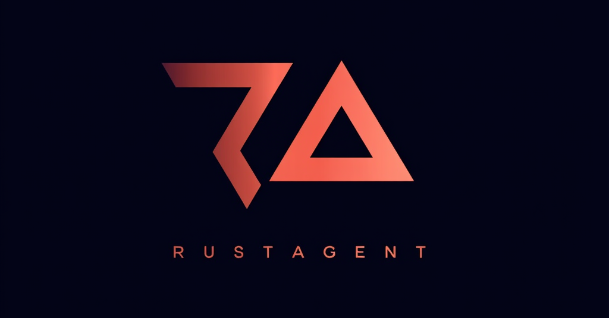

# RustAgent



**RustAgent** is an open-source, browser-based web automation tool written in Rust and compiled to WebAssembly (WASM). It serves as a free alternative to tools like OpenAI Operator, offering flexible LLM (Large Language Model) integration and a multi-agent system for automating web tasks. Whether you need to fill forms, navigate pages, or scrape data, RustAgent aims to provide a lightweight, extensible solution.

## Features
- **Runs in the Browser**: Powered by WebAssembly for seamless client-side execution.
- **Multi-Agent System**: Coordinate tasks across multiple agents (e.g., navigators, form-fillers, generic).
- **Flexible LLM Support**: Integrate with any LLM via API. The LLM can provide natural language responses or guide specific actions.
- **LLM-Guided DOM Execution**: The LLM can suggest sequences of specific DOM commands (e.g., click, type, read) to perform complex web interactions. RustAgent parses these commands from the LLM's JSON response, enabling more adaptive and precise automation.
- **DOM Manipulation**: Directly interacts with web page elements using `web-sys` for tasks like clicking, typing, reading text/attributes, and selecting options.
- **Rust-Powered**: Leverages Rust’s performance, safety, and concurrency.
- **Open Source**: Free to use, modify, and contribute to.

## Installation

### Prerequisites
- [Rust](https://www.rust-lang.org/tools/install) (install via `curl --proto '=https' --tlsv1.2 -sSf https://sh.rustup.rs | sh`)
- WASM target: `rustup target add wasm32-unknown-unknown`
- [wasm-pack](https://rustwasm.github.io/wasm-pack/installer/) (`cargo install wasm-pack`)
- A local HTTP server (e.g., `python -m http.server`)

### Build
1. Clone the repository:
   ```bash
   git clone https://github.com/makalin/rustagent.git
   cd rustagent
   ```
2. Build the WASM module:
   ```bash
   wasm-pack build --target web
   ```
   To use mock LLM responses for testing (as used in integration tests):
   ```bash
   wasm-pack build --target web -- --features mock-llm
   ```
3. Serve the project:
   ```bash
   python -m http.server 8000
   ```
4. Open `http://localhost:8000` in your browser (ensure `index.html` is at the root or adjust path).

## Usage
The primary way to interact with RustAgent from JavaScript is through the `RustAgent` class and its `automate` method.

```javascript
// JavaScript (e.g., in index.html or your web application)
const agent = new RustAgent();

// Configure LLM details (replace with your actual API key, URL, and model name)
agent.set_llm_config("YOUR_LLM_API_URL", "YOUR_MODEL_NAME", "YOUR_API_KEY");

// Example: Automate a single task or a sequence of tasks
async function runAutomation() {
    const tasks = [
        "Describe the main button on this page." 
        // This might go to an LLM which could respond with natural language,
        // or if the LLM is capable, it might return a DOM command to read the button.
    ];
    const tasks_json = JSON.stringify(tasks);
    
    try {
        const result_js_value = await agent.automate(tasks_json);
        const results_array_json = result_js_value.as_string();
        console.log("Automation Results (JSON string of Vec<Result<String, String>>):", results_array_json);
        // Example output: "[{\"Ok\":\"Agent 3 (Generic) completed task via LLM: The main button is blue and says 'Submit'.\"}]"
    } catch (error) {
        console.error("Automation failed:", error);
    }
}

// runAutomation(); 
```

### LLM-Driven DOM Automation Example
If a task like `"login to the website with username 'user' and password 'pass'"` is sent to an agent, the LLM can analyze this and respond with a structured JSON array of commands:
```json
[
  {"action": "TYPE", "selector": "css:#usernameField", "value": "user"},
  {"action": "TYPE", "selector": "css:#passwordField", "value": "pass"},
  {"action": "CLICK", "selector": "css:#loginButton"}
]
```
RustAgent will then parse this JSON and execute these DOM commands sequentially. If the LLM's response is not a valid JSON array of commands, it's treated as a natural language response from the LLM. The result for this step in the `automate` output array would be a JSON string representing the outcomes of these individual DOM commands (e.g., `"[{\"Ok\":\"Successfully typed 'user' in element with selector: 'css:#usernameField'\"}, ...]"`).

### Chaining Tasks with `{{PREVIOUS_RESULT}}`
When providing a list of tasks to the `automate` function, you can use the `{{PREVIOUS_RESULT}}` placeholder in a task string. This placeholder will be replaced by the successful string output of the immediately preceding task. This allows for creating sequences where one task's output becomes the input for the next.

For example, to read text from one element and type it into an input field:
```javascript
// tasks_json input to automate:
const tasks = [
  "READ css:#sourceData", // Task 1: Reads text content from #sourceData
  "TYPE css:#targetInput {{PREVIOUS_RESULT}}" // Task 2: Types the result of Task 1 into #targetInput
];
const tasks_json = JSON.stringify(tasks);
// await agent.automate(tasks_json)...
```
If the task `"READ css:#sourceData"` successfully executes, its output (e.g., `"Agent X (Role): Text from element 'css:#sourceData': Actual text read"`) will replace `{{PREVIOUS_RESULT}}` in the second task string. The second task then becomes `"TYPE css:#targetInput Agent X (Role): Text from element 'css:#sourceData': Actual text read"`.

If the preceding task fails, the `{{PREVIOUS_RESULT}}` placeholder will be replaced with an empty string. The result of a task that successfully executes multiple LLM-suggested DOM commands will be a JSON string representing the outcomes of those sub-commands; this entire JSON string would then become the `{{PREVIOUS_RESULT}}` for the next step.

## Available Direct DOM Commands
The agent system can directly parse and execute the following commands if a task string starts with one of these keywords:

*   `CLICK <selector>`: Clicks the specified element.
*   `TYPE <selector> <text_to_type>`: Types the given text into an input element.
*   `READ <selector>`: Reads the text content of the element.
*   `GETVALUE <selector>`: Gets the value of a form element (input, textarea, select).
*   `GETATTRIBUTE <selector> <attribute_name>`: Gets the specified attribute's value from the element.
*   `SETATTRIBUTE <selector> <attribute_name> <value>`: Sets an attribute on the element.
*   `SELECTOPTION <selector> <option_value>`: Selects an option in a dropdown by its value.
*   `GET_ALL_ATTRIBUTES <selector> <attribute_name>`: Gets a specific attribute from all elements matching the selector. Returns a JSON array of strings (attribute values) or nulls (if attribute is missing).
*   `GET_URL`: Gets the current page URL. No arguments needed.
*   `ELEMENT_EXISTS <selector>`: Checks if an element exists on the page (returns "true" or "false" as a string).
*   `WAIT_FOR_ELEMENT <selector> [timeout_ms]`: Waits for an element to appear in the DOM. `timeout_ms` is optional (defaults to 5000ms).
*   `IS_VISIBLE <selector>`: Checks if an element is currently visible in the layout (considers `display`, `visibility`, and dimensions).
*   `SCROLL_TO <selector>`: Scrolls the page to make the specified element visible in the viewport.

**Note:** Selectors can be CSS selectors (e.g., `css:#myId`, `.myClass`, or simply `#myId`) or XPath expressions (prefixed with `xpath:`, e.g., `xpath://div[@id='example']`). If no prefix is given, CSS is assumed.

The agent can also process more general natural language queries (e.g., "summarize the page", "find the login button and click it"). In such cases, an LLM attempts to translate the query into one or more of the above DOM commands or provides a direct textual answer.

## Project Structure
```
rustagent/
├── Cargo.toml       # Rust dependencies and config
├── src/
│   ├── lib.rs       # WASM entry point, automate orchestrator
│   ├── agent.rs     # Multi-agent system, DOM command execution logic
│   ├── dom_utils.rs # Core DOM manipulation functions
│   └── llm.rs       # LLM integration (real and mock)
├── tests/
│   ├── integration_test.rs # End-to-end tests for RustAgent and DOM utils
│   └── test_page.html      # HTML page used by integration tests
└── index.html       # Basic browser demo page
```

## Roadmap
- **Enhanced LLM Capabilities**: Deeper integration for more complex reasoning and task breakdown.
- **Configurable LLM Endpoints**: Easier configuration of LLM endpoints (e.g., Hugging Face, local models) perhaps via UI or JS settings.
- **Advanced Multi-Agent Coordination**: More sophisticated strategies for agent collaboration.
- **User-Friendly UI**: A more comprehensive UI for defining tasks, managing agents, and viewing results.
- **Error Handling and Recovery**: More robust mechanisms for dealing with unexpected page states or errors during automation.
- **Expanded DOM Command Set**: Support for more DOM interactions (e.g., hover, scroll, iframe handling).

## Contributing
We welcome contributions! Here’s how to get started:
1. Fork the repository.
2. Create a branch: `git checkout -b feature/your-feature`.
3. Commit changes: `git commit -m "Add your feature"`.
4. Push to your fork: `git push origin feature/your-feature`.
5. Open a Pull Request.

Please check [issues](https://github.com/makalin/rustagent/issues) for tasks. (Note: Link will be active once repo is public on GitHub under this path).

## License
RustAgent is licensed under the [MIT License](LICENSE). Feel free to use, modify, and distribute it.

## Acknowledgments
- Built with [Rust](https://www.rust-lang.org/) and [wasm-bindgen](https://rustwasm.github.io/wasm-bindgen/).
- Inspired by the need for open-source, browser-based automation tools.
```
